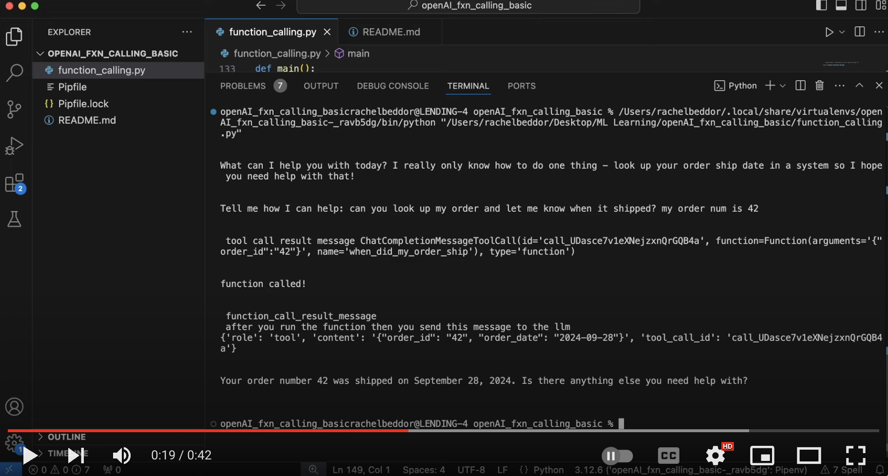

## Basic Function Calling

- I will fill out more of this later but wanted to put something up for now 

- I attended a cloudflare openai meetup where I learned about new openai feature for structured outputs (i'll put that code up later too - that's way cooler)

- It made me want to practice basic function calling

- This is basic and doesn't use structured outputs that I can tell, I was just doing it to get a feel for how to do this procedure

- in a *plot twist*, chatgpt did not write very much of this code for me!! I really had to go through it myself (which is great for learning). It was actually not great at understanding open ai's documentation / features 

## Demo 

## What this code does
- the demo really shows it by printing out info as the procedure occurs but basically
- there's a basic function that just makes a random ship date based on your order num 
- if triggered by the user prompt, the open ai api key calls the function 

## prerequisites
- just openai & requests
- make sure your openai api key set in os env variable

